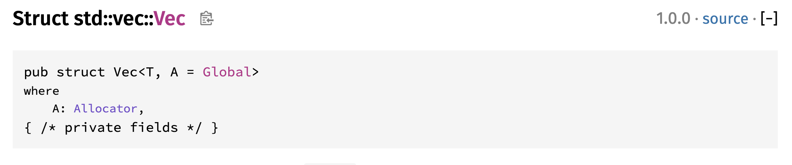
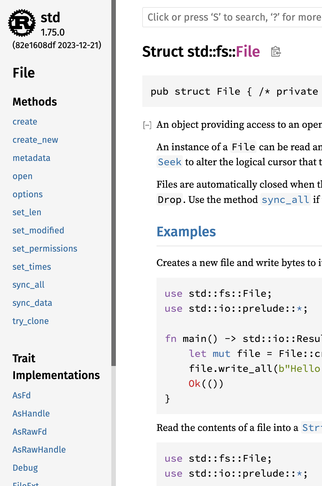
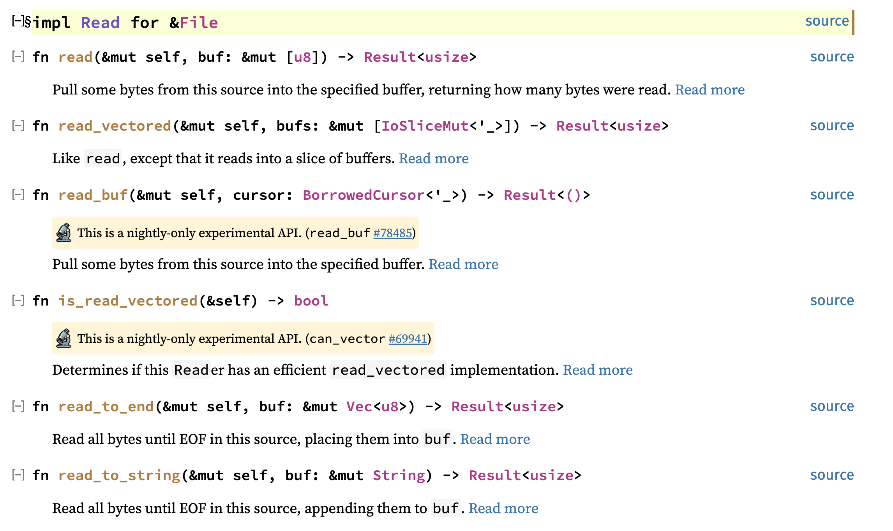

# 표준 라이브러리와 트레이트

러스트의 std 패키지에 있는 표준 라이브러리와 트레이트 중 몇가지 자주 사용되는 것들을 소개하겠습니다. 

## 벡터 타입 std::vec::Vec

러스트로 프로그래밍을 할 때 가장 많이 사용하는 라이브러리가 벡터 타입이라고 생각합니다. 말 그대로 같은 타입의 데이터들을 배열같이 저장하는 것인데, 크기에 제한이 없고 아주 많은 메소드들을 지원하고 있어서 데이터를 저장할 때 가장 많이 사용하는 타입입니다.

문자열을 나타내는 String도 사실은 u8타입 데이터를 벡터에 저장한 것입니다. (https://doc.rust-lang.org/src/alloc/string.rs.html#365) 

---

어떤 타입이나 트레이트가 실제로 어떻게 정의되어있는지 알면 좀더 사용하기 편리합니다. 온라인 매뉴얼을 통해 쉽게 확인해볼 수 있는 방법이 있습니다.

String타입의 매뉴얼 https://doc.rust-lang.org/std/vec/struct.Vec.html 을 열어보시면 페이지 오른쪽 위에 소스를 볼 수 있는 링크 source가 있습니다.



source를 클릭하면 해당 타입의 소스 코드로 넘어갑니다.

특정 메소드의 코드를 보고 싶다면 마찬가지로 매뉴얼에서 해당 메소드에 대한 항목을 보면 source 버튼이 있습니다.


---

벡터는 사실 거의 모든 언어마다 다 있는 것이니 굳이 길게 설명하지않고 러스트에서 자주 사용하는 패턴을 이용한 예제를 보겠습니다.

```rust
use std::vec::Vec;

#[derive(Debug)]
struct Book {
    title: String,
    author: String,
    published: u32,
}

fn find_rust<'a>(books: &'a Vec<Book>) -> Vec<&'a Book> {
    let mut found: Vec<&Book> = Vec::new();
    for b in books.iter() {
        if b.title.contains("Rust") {
            found.push(b);
        }
    }
    found
}

fn main() {
    let rust_book = Book {
        title: String::from("The Rust Programming Language"),
        author: String::from("Steve Klabnik and Carol Nichols"),
        published: 20230228,
    };

    let rust_in_action = Book {
        title: String::from("Rust in Action"),
        author: String::from("Tim McNamara"),
        published: 20210810,
    };

    let another = Book {
        title: String::from("The another book"),
        author: String::from("Unknown"),
        published: 20111111,
    };

    let mut library: Vec<Book> = Vec::new();
    library.push(rust_book);
    library.push(rust_in_action);
    library.push(another);

    let rust_books = find_rust(&library);
    let mut only_titles: Vec<String> = Vec::new();

    if rust_books.is_empty() {
        println!("Cannot find any Rust book");
    } else {
        for b in rust_books.into_iter() {
            let mut title = b.title.clone();
            title.push('\n');
            only_titles.push(title);
        }
    }

    let collect = only_titles.into_iter().collect::<String>();
    println!("{}", collect);
}
```

벡터에 데이터를 추가하는 메소드는 push()입니다. 다음과 같이 vec이라는 매크로를 사용해서 변수 선언과 데이터 추가를 동시에 할 수도 있습니다.

```rust
let mut library = vec![rust_book, rust_in_action, another];
```

여기에 러스트 언어의 특성상 주의할 것이 있습니다. push()메소드이 인자를 보면 벡터에 저장할 객체의 참조를 사용하는게 아니라 값을 전달합니다. 바로 여기에서 러스트 언어의 소유권 이동이 발생합니다. 아래와같이 벡터에 저장한 객체를 다시 사용하려고 해보면 “value borrowed here after move” 에러가 발생하는 것을 알 수 있습니다.

```rust
let mut library: Vec<Book> = Vec::new();
library.push(rust_book);
library.push(rust_in_action);
library.push(another);
println!("{:?}", rust_book);
```

library에 rust_book 객체의 소유권이 옮겨진 이후로 rust_book 객체에 접근할 수 없습니다.

그리고 find_rust 함수를 호출합니다. 함수 인자로는 벡터의 참조를 전달합니다. books.iter()는 books 벡터에 저장된 각 Book타입 객체의 참조 포인터를 반환합니다. 따라서 b는 &Book타입입니다. 결국 find_rust 함수가 하는 일은 books에 저장된 각 책의 제목중에 Rust라는 단어가있는 책들의 참조 포인터만 골라서 found 벡터에 저장하는 것입니다.

이제 rust_books라는 벡터에는 책 제목에 Rust가 들어간 책들의 참조 포인터가 저장되었습니다. 그리고 그 다음 for 루프에서는 그렇게 찾은 책들의 제목만 only_titles라는 벡터로 저장합니다. 여기에 책 제목의 String타입의 참조 포인터를 저장할 수도 있습니다만 나중에 책 제목을 출력할 때 한 줄에 하나씩 출력하기위해 ‘\n’을 추가해야하므로 참조가 아니라 String 객체를 저장했습니다.

마지막으로 only_titles벡터의 이터레이터에 collect() 메소드를 호출합니다. 그러면 각 String 타입 객체들이 합쳐져서 하나의 String 타입 객체가 됩니다. 프로그램의 출력은 하나의 String 객체가 됩니다.

```rust
% cargo run
The Rust Programming Language
Rust in Action

%
```

제가 이 예제에서 보여드리고자하는 벡터의 사용패턴은

1. iter()/into_iter()를 사용하여 각 데이터에 접근하기
2. 원본 벡터안의 객체중 일부를 다른 벡터로 저장할 때 참조 포인터와 라이프타임을 사용하기
3. 벡터안의 객체들을 합치기위해 이터레이터와 collect() 메소드 사용하기

그 외에 자주 사용하는 메소드들을 보자면

- len: 현재 벡터에 몇개의 데이터가 있는지 알려줍니다.
- &[index]: []를 사용해서 index 위치의 객체에 접근할 수 있습니다. index는 usize 타입만 허용됩니다. 그냥 library[index]같은 형태로 객체에 접근하려고하면 소유권 이동이 발생하므로 허용되지 않습니다. 그래서 보통 &library[index]같이 특정 위치의 객체에 대한 참조 포인터를 얻을 때 사용합니다.
- push/pop: 벡터의 마지막에 데이터를 추가하거나 빼는 메소드입니다. 스택과 같다고 생각하면됩니다.
- insert/remove: 특정 위치에 데이터를 넣거나 빼는 메소드입니다. 벡터 내부의 데이터를 이동해야되므로 상황에 따라 실행속도가 느려질 수 있습니다.
- as_ptr/as_mut_ptr: 데이터 배열의 포인터를 얻습니다. 만약 C/C++ 코드와 같이 사용하게된다면 이 메소드를 자주 사용하게 될 것입니다

그리고 벡터를 생성할때 Vec::from() 메소드를 사용하기도하지만 vec! 매크로를 사용하는 경우가 더 많습니다.

```rust
fn main() {
    let library = vec![
        Book {
            title: String::from("The Rust Programming Language"),
            author: String::from("Steve Klabnik and Carol Nichols"),
            published: 20230228,
        },
        Book {
            title: String::from("Rust in Action"),
            author: String::from("Tim McNamara"),
            published: 20210810,
        },
        Book {
            title: String::from("The another book"),
            author: String::from("Unknown"),
            published: 20111111,
        },
    ];
......
```

마지막으로 한가지 더 팁을 드리자면 벡터의 참조 포인터를 함수로 전달하면 슬라이스가 됩니다. find_rust함수를 다음과 같이 슬라이스를 전달받도록 만들 수도 있습니다. 이렇게 만들면 벡터뿐 아니라 배열을 처리하는 함수로도 만들 수 있기 때문에 좀더 유연한 코드를 만들 수 있습니다.

```rust
fn find_rust<'a>(books: &'a [Book]) -> Vec<&'a Book> {
    let mut found: Vec<&Book> = Vec::new();
    for b in books.iter() {
        if b.title.contains("Rust") {
            found.push(b);
        }
    }
    found
}
```

### 연습문제

- Vec타입의 소스 코드를 확인해보세요. 매뉴얼에 소스 코드를 볼 수 있는 링크가 있습니다. 생각보다 단순하게 구현된 타입인데 어떻게 그렇게나 많은 메소드를 지원할 수 있을까요? 데이터 크기를 늘릴 수 있는 배열이라는 컨셉의 장단점을 조사해보세요. 데이터구조를 공부하는데 중요한 배경지식이 될 것입니다.
- https://doc.rust-lang.org/std/vec/struct.Vec.html#guarantees 벡터의 내부 구조에 대해서 더 자세히 이해하고싶다면 이 문서를 참고하세요.


## 해쉬맵 std::collections::HashMap

아마도 Vector만큼이나 많이 사용되는 자료구조를 들자면 해쉬맵HashMap을 꼽을 수 있을 것입니다.

우선 간단하게 사용하는 예제를 보겠습니다.

```rust
use std::collections::HashMap;

#[derive(Debug)]
struct Book {
    title: String,
    author: String,
    published: u32,
}

fn main() {
    let mut library: HashMap<String, Book> = HashMap::new();
    let the_book = Book {
        title: String::from("The Rust Programming Language"),
        author: String::from("Steve Klabnik and Carol Nichols"),
        published: 20230228,
    };
    library.insert("718503105".to_owned(), the_book);
    library.insert(
        "1617294551".to_owned(),
        Book {
            title: String::from("Rust in Action"),
            author: String::from("Tim McNamara"),
            published: 20210810,
        },
    );
    library.insert(
        "0000000000".to_owned(),
        Book {
            title: String::from("The another book"),
            author: String::from("Unknown"),
            published: 20111111,
        },
    );

    let found = library.get("0000000000");
    println!("{:?}", found);
    let not_found = library.get("xxxxxxxxxx");
    println!("{:?}", not_found);
}
```

library변수에 해쉬맵으로 여러권의 책을 저장하고 있습니다. 키는 ISBN값이고 저장값은 Book 타입의 객체입니다. 해쉬맵에 데이터를 저장하기위해서 insert 메소드를 사용하고 키에 해당하는 데이터를 얻기 위해서 get 메소드를 사용합니다.

주의해야 할 것은 insert 메소드에 값을 저장할 때 객체의 값을 전달한다는 것입니다. 만약 the_book 객체를 library에 저장한 후에는 the_book 객체에 대한 소유권이 library로 이동합니다. 따라서 the_book이라는 변수를 다시는 사용할 수 없습니다.

그리고 하나 더 주의할 것이 있는데 insert 메소드는 이미 키가 존재할 경우 데이터를 덮어쓴다는 것입니다. 그러니 실제 제품 개발에서는 항상 데이터가 있는지를 확인하는게 필요합니다. 데이터가 있는지 확인하는 방법은 연습문제로 남겨놓았습니다.

그리고 한가지 예제를 더 보겠습니다. 이전 예제는 키 값이 간단한 스트링 타입이었습니다. 이번 예제는 직접 만든 구조체 타입을 키로 사용하는 예제입니다.

```rust
use std::collections::HashMap;

#[derive(Debug)]
struct Book {
    title: String,
    author: String,
    published: u32,
}

fn main() {
    let mut library: HashMap<Book, String> = HashMap::new();
    library.insert(
        Book {
            title: String::from("The Rust Programming Language"),
            author: String::from("Steve Klabnik and Carol Nichols"),
            published: 20230228,
        },
        "1718503105".to_owned(),
    );
    library.insert(
        Book {
            title: String::from("Rust in Action"),
            author: String::from("Tim McNamara"),
            published: 20210810,
        },
        "1617294551".to_owned(),
    );
    library.insert(
        Book {
            title: String::from("The another book"),
            author: String::from("Unknown"),
            published: 20111111,
        },
        "0000000000".to_owned(),
    );

    let found = library.get(&Book {
        title: String::from("The another book"),
        author: String::from("Unknown"),
        published: 20111111,
    });
    println!("{:?}", found);
}
```

이전 예제와 반대로 책의 정보를 가지고 ISBN값을 찾는 예제입니다. 이 예제를 빌드하면 아래와 같은 에러 메세지를 볼 수 있습니다. 

```rust
error[E0599]: the method `insert` exists for struct `HashMap<Book, String>`, but its trait bounds were not satisfied
  --> src/main.rs:12:13
   |
4  | struct Book {
   | -----------
   | |
   | doesn't satisfy `Book: Eq`
   | doesn't satisfy `Book: Hash`
   | doesn't satisfy `Book: PartialEq`
...
12 |     library.insert(
   |     --------^^^^^^
   |
   = note: the following trait bounds were not satisfied:
           `Book: Eq`
           `Book: PartialEq`
           which is required by `Book: Eq`
           `Book: Hash`
help: consider annotating `Book` with `#[derive(Eq, Hash, PartialEq)]`
   |
4  + #[derive(Eq, Hash, PartialEq)]
5  | struct Book {
   |

error[E0599]: the method `insert` exists for struct `HashMap<Book, String>`, but its trait bounds were not satisfied
  --> src/main.rs:20:13
   |
4  | struct Book {
   | -----------
   | |
   | doesn't satisfy `Book: Eq`
   | doesn't satisfy `Book: Hash`
   | doesn't satisfy `Book: PartialEq`
...
20 |     library.insert(
   |     --------^^^^^^
   |
   = note: the following trait bounds were not satisfied:
           `Book: Eq`
           `Book: PartialEq`
           which is required by `Book: Eq`
           `Book: Hash`
help: consider annotating `Book` with `#[derive(Eq, Hash, PartialEq)]`
   |
4  + #[derive(Eq, Hash, PartialEq)]
5  | struct Book {
   |

error[E0599]: the method `insert` exists for struct `HashMap<Book, String>`, but its trait bounds were not satisfied
  --> src/main.rs:28:13
   |
4  | struct Book {
   | -----------
   | |
   | doesn't satisfy `Book: Eq`
   | doesn't satisfy `Book: Hash`
   | doesn't satisfy `Book: PartialEq`
...
28 |     library.insert(
   |     --------^^^^^^
   |
   = note: the following trait bounds were not satisfied:
           `Book: Eq`
           `Book: PartialEq`
           which is required by `Book: Eq`
           `Book: Hash`
help: consider annotating `Book` with `#[derive(Eq, Hash, PartialEq)]`
   |
4  + #[derive(Eq, Hash, PartialEq)]
5  | struct Book {
   |

error[E0599]: the method `get` exists for struct `HashMap<Book, String>`, but its trait bounds were not satisfied
  --> src/main.rs:37:25
   |
4  | struct Book {
   | -----------
   | |
   | doesn't satisfy `Book: Eq`
   | doesn't satisfy `Book: Hash`
   | doesn't satisfy `Book: PartialEq`
...
37 |     let found = library.get(&Book {
   |                 --------^^^ method cannot be called on `HashMap<Book, String>` due to unsatisfied trait bounds
   |
   = note: the following trait bounds were not satisfied:
           `Book: Eq`
           `Book: PartialEq`
           which is required by `Book: Eq`
           `Book: Hash`
help: consider annotating `Book` with `#[derive(Eq, Hash, PartialEq)]`
   |
4  + #[derive(Eq, Hash, PartialEq)]
5  | struct Book {
   |
```

insert와 get 메소드를 사용하기 위해서 Book 구조체에 Eq, Hash, PartialEq 트레이트의 구현이 있어야한다는 에러 메세지입니다. 에러를 해결하는 것은 컴파일러가 안내하는대로 아래와 같이 각 트레이트의 구현을 추가해주면 됩니다.

```rust
use std::collections::HashMap;

#[derive(Debug, Eq, Hash, PartialEq)]
struct Book {
    title: String,
    author: String,
    published: u32,
}

fn main() {
    let mut library: HashMap<Book, String> = HashMap::new();
    library.insert(
        Book {
            title: String::from("The Rust Programming Language"),
            author: String::from("Steve Klabnik and Carol Nichols"),
            published: 20230228,
        },
        "1718503105".to_owned(),
    );
    library.insert(
        Book {
            title: String::from("Rust in Action"),
            author: String::from("Tim McNamara"),
            published: 20210810,
        },
        "1617294551".to_owned(),
    );
    library.insert(
        Book {
            title: String::from("The another book"),
            author: String::from("Unknown"),
            published: 20111111,
        },
        "0000000000".to_owned(),
    );

    let found = library.get(&Book {
        title: String::from("The another book"),
        author: String::from("Unknown"),
        published: 20111111,
    });
    println!("{:?}", found);
}
```

그럼 왜 이런 에러가 발생하는 것일까요? 키 값으로 우리가 직접 만든 타입을 사용할 때 키 값을 비교할 수가 없기 때문입니다. insert나 get에서 키 값을 비교할 때 두개의 객체를 비교해야하는데, 구조체 타입의 경우 어떻게 두 객체의 값을 비교해야하는지 알지 못합니다. 그래서 PartialEq와 Eq가 모두 구현되어야합니다.

그리고 Hash라는 트레이트의 구현도 필요합니다. hash 트레이트는 해당 타입의 해쉬 Hash 값을 계산하기 위한 트레이트입니다. Book 구조체에는 String 타입 2개의 u32 타입 1개의 데이터가 들어있습니다. Hash 트레이트의 구현을 추가해주면 각 데이터들의 해쉬값을 조합해서 최종 Book 타입 객체의 해쉬값을 계산합니다. 러스트의 해쉬맵 라이브러리가 내부적으로 객체의 해쉬값을 이용해서 데이터를 검색하고 저장하기 때문에, 우리가 직접 만든 타입을 사용해서 키를 지정하고 싶다면 해시값을 생성하는 방법도 해쉬맵 라이브러리에 알려주어야합니다.

물론 각 트레이트의 구현을 직접 구현할 수도 있습니다. 책을 비교할 때 제목, 저자, 출판일을 모두 비교하는게 아니라 제목만 비교할 수도 있으니까요. 저는 해쉬맵의 소개를 위해서 최대한 간단하게 소스를 구현해봤지만, 직접 각 트레이트를 구현해보는 것도 좋은 연습이 될듯합니다.

### 연습문제

- ISBN이 “0000000000”인 책의 제목은 “The another book”입니다. library에서 entry 메소드를 이용해서 이 책의 제목을 “Not released book book”으로 바꾸는 코드를 만들어보세요. entry메소드는 library에 있는 데이터중에 특정한 키의 값이 있는지를 확인하는 메소드이고, Entry라는 Enum 형의 값을 반환합니다. Entry가 무엇인지 확인해보고, 값이 이미 있을때의 반환값과, 값이 없을 때의 반환값이 어떻게 다른지 확인해보세요. 그리고 Entry의 메소드 중에 어떤 메소드를 사용하면 찾는 값이 없을때만 데이터를 넣을 수 있는지 매뉴얼을 검색해보세요.

## 파일 읽고 쓰기위한 std::{fs::File, io::Read, path::PathBuf}

파일을 읽거나 쓰는 것은 거의 모든 프로그램에서 처리하는 일이므로 새로운 언어를 배울 때 반드시 알아봐야하는 것들 중 하나입니다.

러스트에서는 파일을 읽고 쓰기 위해 3가지 module을 알아야합니다. 일단 각각이 무엇인지 간단하게 설명하고 어떻게 사용하는지를 알아보겠습니다.

1. std::fs: 로컬 파일시스템에 있는 파일을 처리하기위한 모듈입니다. 일반적으로 운영체제에 상관없이 사용할 수 있는 기능들을 모아놓은 것입니다. 그 중에서 File 구조체가 일반 파일에 접근할 때 사용됩니다.
2. std::io: 입출력을 위한 타입, 라이브러리, 에러 타입 등을 모아놓은 모듈입니다. Read, Write라는 trait가 있습니다. 주의할 것은 std::io::Read라는 trait가 있다는 것의 의미를 알아야합니다. 트레이트가 있다는 것은 다른 어딘가에 구현체가 있어야 한다는 것입니다. 코드 파일에 use std::io::Read라고 선언을 해서 사용은 하지만 사실 구현체는 다른 곳에 있습니다. 예를 들면 std::fs::File 구조체가 std::io::Read트레이트를 구현하고 있습니다. 아래 예제에서 사용 방법을 보겠습니다. 
3. std::path: 파일을 처리하기 위해서는 파일의 경로를 알아야합니다. 보통 문자열로 사용할 수도 있겠지만, 문자열로 경로를 표현하면 운영체제에 종속적으로 동작할 수 밖에 없습니다. 어느 운영체제나 플랫폼에서도 동작하기 위해서는 파일의 경로를 추상화해야합니다. std::path에 있는 PathBuf와 Path 타입이 파일의 경로를 추상화하는 것들입니다.

이제 이 3가지를 가지고 파일을 읽는 예제를 한번 만들어보겠습니다.

```rust
use std::{
    env::current_dir,
    fs::File,
    io::Read,
    path::{Path, PathBuf},
};

/// &Path is immutable form of PathBuf (same to &str and String)
fn grep(filename: &Path, word: &str) {
    let mut f: File = File::open(filename).unwrap();
    let mut text_buffer = String::new();

    f.read_to_string(&mut text_buffer).unwrap();
    for line in text_buffer.split('\n') {
        if line.contains(word) {
            println!("{line}");
        }
    }
}

fn main() {
    let mut filename: PathBuf = current_dir().unwrap();

    filename.push("src/main.rs"); // Be careful not to use  "/src/main.rs"
    grep(&filename, "main"); // show lines that include specific word
}
```

main함수에서 첫번째로 하는 일은 current_dir()함수를 호출해서 프로그램이 실행되는 위치를 알아내는 것입니다. 우리는 “cargo run” 명령으로 프로그램을 실행할 것이므로 현재위치에 “src/main.rs” 경로를 추가하면 main.rs 파일의 위치가 될 것입니다.

한가지 주의해야할 것은 filename의 push() 메소드에 “/src/main.rs”와 같이 절대경로를 전달하면 안된다는 것입니다. push() 메소드는 filename에 저장된 경로에 이어서 하위 경로를 추가하는 일을 하지만, 만약에 전달된 경로가 “/”로 시작하는 절대 경로라면 filename에 저장된 경로를 지우고 전달된 경로로 바꾸게 됩니다. 결국 “/src/main.rs” 파일을 읽으려고하고 에러가 발생할 것입니다.

그리고 grep이라는 함수를 호출합니다. grep 함수의 인자에는 filename의 참조를 전달합니다. 그런데 특이한게 있습니다. PathBuf타입의 변수의 참조를 전달하는데 grep 함수의 인자는 &Path가 되는 것입니다. 주석에도 써놓았듯이 PathBuf는 일반적으로 경로를 추가하거나 바꿀 수 있는 타입입니다. 그리고 참조를 해서 포인터만 절달하게되면 &Path 타입이 됩니다. String과 &str의 관계와 동일합니다. 이렇게 하는 이유는 컴파일의 효율성을 높여서 성능을 높이기 위한 것입니다. PathBuf를 처음 생성해서 PathBuf타입으로 가지고 있을때 최대한 모든 처리를 실행해서 경로를 추가하거나 지우거나해서 최종 경로를 만들어내고, 다른 함수에 전달할 때는 &Path 타입으로 전달하도록하면 성능을 높일 수 있습니다. 프로그램이 보통 설정 파일이나 특정 파일을 찾을 때는 경로를 저장하는 변수의 값을 바꾸지만, 파일을 찾고나면 경로를 바꿀 일이 드뭅니다. 이미 있는 파일의 경로를 바꿀 일이 많지는 않으니까요. 파일을 지우더라도 경로는 바뀌지 않습니다. 그래서 읽기 전용으로 경로를 관리할 일이 많으므로 이렇게 별도의 타입을 만들었다고 생각됩니다. 최대한 활용하시기 바랍니다.

grep 함수는 전달된 파일 경로를 이용하여 파일을 열고 파일을 관리하기 위한 std::fs::File 타입의 객체를 반환합니다. File객체는 std::io::Read 트레이트를 구현하고 있어서 read()나 read_to_string() 메소드를 가지고 있습니다. 

---

여기서 잠깐 어떤 구조체 타입이 어느 트레이트를 구현하고 있는지를 확인하는 방법을 알아보겠습니다. 우선 std::fs::File 구조체의 매뉴얼을 열어보겠습니다. https://doc.rust-lang.org/std/fs/struct.File.html 링크를 열면 페이지 왼쪽에 다음과 같이 자체 메소드와 구현된 트레이트의 리스트가 보입니다.




create나 open은 File 구조체의 자체 메소드입니다. 그리고 아까 이야기했던 Read 트레이트가 리스트에 있을 것입니다. 클릭해보면 다음과 같이 read나 read_to_string() 메소드가 있다고 나옵니다. 트레이트 리스트에 Read가 2개가 있는데 자세히 보면 하나는 &File을 위한 트레이트 구현이고 다른 하나는 File을 위한 트레이트 구현입니다. 참조를 사용하냐 변수 그대로 사용하냐에 따라서 구현된 트레이트가 달라집니다. 트레이트의 메소드의 인자에 &self가 있을지 Self가 있을지에 따라 다른 것입니다. &self인 경우 객체의 데이터가 바뀔 수 없고, Self인 경우 객체의 데이터가 바뀌거나 객체가 해지될 수도 있습니다. read()나 read_to_string()은 양쪽에 다 존재합니다.




예제에서 read_to_string()을 사용하니까 read_to_string() 메소드의 설명 부분에서 Read more를 클릭해봅시다. 페이지가 Trait std::io::Read로 넘어가게됩니다. 따라서 우리는 read_to_string() 메소드를 사용하기 위해서는 use std::io::Read라는 선언을 추가해줘야한다는 것을 알게됩니다.

---

read_to_string()메소드는 설명에서 보는 것과같이 파일 전체의 내용을 String타입 변수에 추가하는 것입니다. 그렇게 파일 전체를 한꺼번에 읽어서 각 라인별로 찾고자하는 문자열을 가지고있는 라인만 출력하게됩니다.

대강 동작은 하는 프로그램입니다. 제가 한가지 고치고 싶은 것은 에러처리를 제대로하는 것이 아니라 unwrap()을 호출하는 것으로 처리하고 있다는 것입니다. 모든 에러 처리를 unwrap() 메소드를 사용한다는 것은 에러가 발생할 때마다 프로그램이 패닉을 발생시키고 종료된다는 것입니다. 에러 처리라는게 사실상 없는 것이나 마찬가지입니다. 좀더 에러를 제대로 처리하기위해 “?” 연산자와 std::io::Result타입(fs::File의 메소드들은 모두 std::io::Result타입으로 에러를 반환합니다)을 이용하여 에러가 발생했을 때 에러를 상위 레벨로 전달하는 방법과 사용자가 이해하기 쉬운 에러 메세지를 출력하는 방법을 알아보겠습니다. 아래 예제는 일부러 존재하지 않는 파일을 읽도록 만들어서 에러를 발생시키는 코드입니다.

```rust
use std::{
    env::current_dir,
    fs::File,
    io::Read,
    path::{Path, PathBuf},
};

/// &Path is immutable form of PathBuf (same to &str and String)
fn grep(filename: &Path, word: &str) -> std::io::Result<()> {
    let mut f: File = File::open(filename)?;
    let mut text_buffer = String::new();

    f.read_to_string(&mut text_buffer)?;
    for line in text_buffer.split('\n') {
        if line.contains(word) {
            println!("{line}");
        }
    }
    Ok(())
}

fn main() -> std::io::Result<()> {
    let mut filename: PathBuf = current_dir()?;

    filename.push("src/wrongfilename.rs");
    grep(&filename, "main")?; // show lines that include specific word
    Ok(())
}
```

```rust
% cargo run
   Compiling ex v0.1.0 (/Users/user/ex)
    Finished dev [unoptimized + debuginfo] target(s) in 0.23s
     Running `target/debug/ex`
Error: Os { code: 2, kind: NotFound, message: "No such file or directory" }
```

프로그램을 실행하면 어떤 에러가 발생했는지 에러의 번호와 에러 타입, 에러를 좀 더 설명하는 메세지를 출력합니다. 에러의 번호는 운영체제가 해당 에러를 어떤 번호로 처리하는지에 따라 달라지는데 리눅스의 경우 “errno -l” 명령으로도 확인할 수 있고, “man errno” 명령으로도 확인할 수 있습니다. kind는 에러의 타입인데 숫자로된 번호를 일종의 타입으로 바꾼것이므로 에러 번호나 마찬가지입니다.

에러를 처리할 때 기본 std::io::Result와 같이 러스트의 기본 모듈이 제공하는 에러 타입을 사용할 수도 있지만 그렇게되면 여러가지 에러 타입들을 처리하기 위해 에러 처리 코드가 복잡해질 수밖에 없습니다. 다음과 같이 std::io::Result를 반환하는 함수와 std::core::Result를 반환하는 함수를 호출하는 함수는 어떤 에러를 반환해야할까요?

```rust
fn multiple_errors(filename: &str, number: &str) -> std::io::Result<()> {
    let mut f = File::open(filename)?; // std::io::Result
    let num: u32 = number.parse()?; // https://doc.rust-lang.org/std/str/trait.FromStr.html#associatedtype.Err
    Ok(())
}

fn multiple_errors(
    filename: &str,
    number: &str,
) -> core::result::Result<(), core::num::ParseIntError> {
    let _ = File::open(filename)?; // std::io::Result
    let _ = number.parse::<u32>()?; // https://doc.rust-lang.org/std/str/trait.FromStr.html#associatedtype.Err
    Ok(())
}
```

std::io::Result<()>를 반환하도록하면 parse()의 에러를 처리하지못하고, parse()의 에러를 반환하도록하면 open()의 에러를 처리하지 못합니다.

결국 프로그램의 규모가 조금이라도 커지게되면 다음과같이 프로그램 고유의 표준 에러 타입을 만들고, 여러가지 에러 타입들을 표준 에러 타입으로 변환해서 사용하게됩니다.
