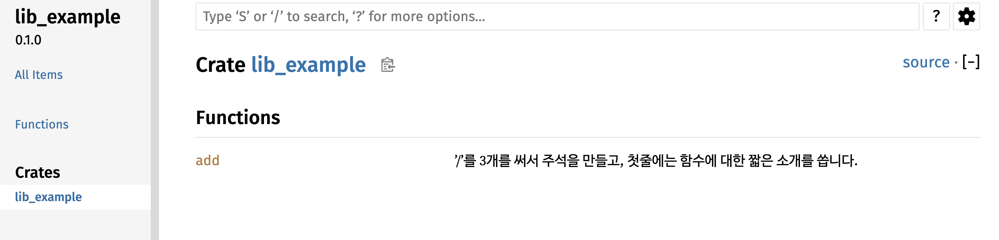
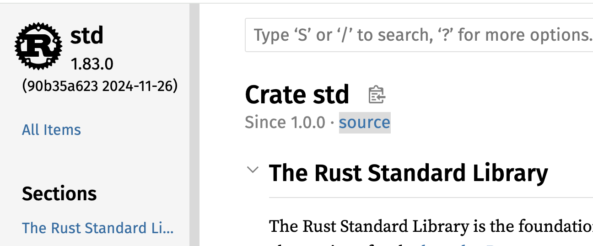
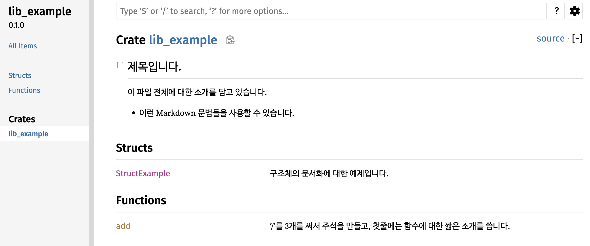

# Cargo 툴 소개

러스트 언어의 컴파일러는 rustc라는 툴입니다. 하지만 rustc를 직접 실행하는 일은 거의 없습니다. 대신 Cargo를 사용합니다. Cargo가 무었인지 어떤 일들을 해주는지를 알아보겠습니다.

가장 먼저 Cargo의 help 메세지를 보면 러스트의 패키지를 관리를 위한 툴이라고 설명합니다.

```bash
quick-guide-rust-programming $ cargo help
Rust's package manager

Usage: cargo [+toolchain] [OPTIONS] [COMMAND]
       cargo [+toolchain] [OPTIONS] -Zscript <MANIFEST_RS> [ARGS]...

Options:
  -V, --version             Print version info and exit
      --list                List installed commands
      --explain <CODE>      Provide a detailed explanation of a rustc error message
  -v, --verbose...          Use verbose output (-vv very verbose/build.rs output)
  -q, --quiet               Do not print cargo log messages
      --color <WHEN>        Coloring: auto, always, never
  -C <DIRECTORY>            Change to DIRECTORY before doing anything (nightly-only)
      --locked              Assert that `Cargo.lock` will remain unchanged
      --offline             Run without accessing the network
      --frozen              Equivalent to specifying both --locked and --offline
      --config <KEY=VALUE>  Override a configuration value
  -Z <FLAG>                 Unstable (nightly-only) flags to Cargo, see 'cargo -Z help' for details
  -h, --help                Print help

Commands:
    build, b    Compile the current package
    check, c    Analyze the current package and report errors, but don't build object files
    clean       Remove the target directory
    doc, d      Build this package's and its dependencies' documentation
    new         Create a new cargo package
    init        Create a new cargo package in an existing directory
    add         Add dependencies to a manifest file
    remove      Remove dependencies from a manifest file
    run, r      Run a binary or example of the local package
    test, t     Run the tests
    bench       Run the benchmarks
    update      Update dependencies listed in Cargo.lock
    search      Search registry for crates
    publish     Package and upload this package to the registry
    install     Install a Rust binary
    uninstall   Uninstall a Rust binary
    ...         See all commands with --list
See 'cargo help <command>' for more information on a specific command.
```

여기에서 패키지는 일반적으로 생각하는 하나의 소프트웨어 설치 파일 rpm이나 deb파일을 말할때 사용하는 패키지가 아닙니다. 러스트에서는 우리가 개발하는 프로젝트를 패키지라고 부릅니다. 패키지를 관리하는 툴이라는 의미는 프로젝트의 개발하는 모든 단계에서 사용되는 툴이라는 의미입니다. 프로젝트 개발을 위한 컴파일, 프로젝트 전체 빌드, 외부 크레이트(러스트에서는 외부 라이브러리를 크레이트라고 부릅니다) 다운로드, 실행 파일 설치 등등 개발 과정의 모든 일을 처리할 수 있습니다. 보통 다른 언어에서는 별도의 툴을 사용해야되는 코드 주석을 문서화하는 기능이나 코드 정렬 등의 기능들도 있습니다.

그리고 help 메세지에 나오는 명령어 리스트가 모든 명령어의 리스트가 아닙니다. 주로 많이 사용되는 명령어들만 보여주고 있습니다. 전체 명령어 리스트를 보려면 `cargo --list` 명령을 사용합니다.

```bash
user@AL02279337 quick-guide-rust-programming % cargo --list
Installed Commands:
    add                  Add dependencies to a Cargo.toml manifest file
    b                    alias: build
    bench                Execute all benchmarks of a local package
    build                Compile a local package and all of its dependencies
    c                    alias: check
    check                Check a local package and all of its dependencies for errors
    clean                Remove artifacts that cargo has generated in the past
    clippy               Checks a package to catch common mistakes and improve your Rust code.
    config               Inspect configuration values
    d                    alias: doc
    doc                  Build a package's documentation
    expand
    fetch                Fetch dependencies of a package from the network
    fix                  Automatically fix lint warnings reported by rustc
    fmt                  Formats all bin and lib files of the current crate using rustfmt.
    generate-lockfile    Generate the lockfile for a package
    git-checkout         This command has been removed
    help                 Displays help for a cargo subcommand
    info                 Display information about a package in the registry
    init                 Create a new cargo package in an existing directory
    install              Install a Rust binary
    locate-project       Print a JSON representation of a Cargo.toml file's location
    login                Log in to a registry.
    logout               Remove an API token from the registry locally
    metadata             Output the resolved dependencies of a package, the concrete used versions including overrides, in machine-readable format
    miri
    new                  Create a new cargo package at <path>
    owner                Manage the owners of a crate on the registry
    package              Assemble the local package into a distributable tarball
    pkgid                Print a fully qualified package specification
    publish              Upload a package to the registry
    r                    alias: run
    read-manifest        Print a JSON representation of a Cargo.toml manifest.
    remove               Remove dependencies from a Cargo.toml manifest file
    report               Generate and display various kinds of reports
    rm                   alias: remove
    run                  Run a binary or example of the local package
    rustc                Compile a package, and pass extra options to the compiler
    rustdoc              Build a package's documentation, using specified custom flags.
    search               Search packages in the registry. Default registry is crates.io
    t                    alias: test
    test                 Execute all unit and integration tests and build examples of a local package
    tree                 Display a tree visualization of a dependency graph
    uninstall            Remove a Rust binary
    update               Update dependencies as recorded in the local lock file
    vendor               Vendor all dependencies for a project locally
    verify-project       Check correctness of crate manifest
    version              Show version information
    yank                 Remove a pushed crate from the index
```

특정 명령어에 대한 보다 자세한 설명을 보고싶으면 `cargo help 명령어`를 사용합니다. 리눅스의 매뉴얼 페이지와 동일한 형태의 매뉴얼을 볼 수 있습니다.
```
user@AL02279337 quick-guide-rust-programming % cargo help add
CARGO-ADD(1)                           General Commands Manual                           CARGO-ADD(1)

NAME
       cargo-add — Add dependencies to a Cargo.toml manifest file

SYNOPSIS
       cargo add [options] crate…
       cargo add [options] --path path
       cargo add [options] --git url [crate…]

DESCRIPTION
       This command can add or modify dependencies.
......
```

다음부터 제가 개발하면서 자주 사용하는 명령어들을 짧게 소개하겠습니다.

## cargo new

현재 디렉토리에 새로운 패키지를 위한 디렉토리를 만들고, Cargo.toml 파일과 .gitignore 파일 등 개발을 시작하기 위해 필요한 파일들을 자동으로 생성해줍니다. 가장 많이 사용하는 옵션은 2가지 `-bin`과 `--lib`입니다. `--bin`옵션은 실행 파일을 만들기위한 패키지를 생성합니다. 지금 예제 파일들의 구조를 보면 전부 src/main.rs파일을 가지고 있습니다. 실행 파일을 만들기 위한 패키지이기 때문에 `--bin`옵션을 이용해서 만들어졌습니다. `--bin`옵션으로 패키지를 하나 생성해보겠습니다.

```bash
$ cargo new --bin bin-example
    Creating binary (application) `bin-example` package
bin-example $ ls -a
.          ..         .git       .gitignore Cargo.toml src
```

bin-example이라는 이름의 패키지를 만들었습니다. 바이너리, 즉 실행 파일을 만들기 위한 패키지입니다. bin-example디렉토리에는 Git툴을 위한 .git디렉토리와 .gitignore파일이 생성되었습니다. 그리고 Cargo자신이 프로젝트 관리를 위하 사용하는 Cargo.toml파일과 소스를 저장할 src 디렉토리가 생성되었습니다. src/main.rs 파일에는 간단한 예제가 들어있습니다.

```rust
bin-example $ cat src/main.rs 
fn main() {
    println!("Hello, world!");
}
```

`--lib`옵션은 라이브러리를 만들기 위한 패키지를 생성할 때 사용합니다. src/main.rs가 아니라 src/lib.rs 파일을 생성합니다.

```
 $ cargo new --lib lib-example
    Creating library `lib-example` package
note: see more `Cargo.toml` keys and their definitions at https://doc.rust-lang.org/cargo/reference/manifest.html
$ cd lib-example
lib-example $ ls -a
.          ..         .git       .gitignore Cargo.toml src
lib-example % ls src/
lib.rs
```

lib.rs파일은 간단한 함수의 예제와 유닛 테스트 예제가 들어있습니다.

```rust
% cat src/lib.rs
pub fn add(left: u64, right: u64) -> u64 {
    left + right
}

#[cfg(test)]
mod tests {
    use super::*;

    #[test]
    fn it_works() {
        let result = add(2, 2);
        assert_eq!(result, 4);
    }
}
```

참고로 .git 디렉토리가 생성되었다고해서 Github이나 자신이 사용하는 저장소와 연결되었다는 것은 아닙니다. `git remote -v`명령을 실행해보면 아무런 저장소도 설정되지 않았다는 것을 확인할 수 있습니다. 본인이 사용한 저장소의 메뉴얼을 참고해서 저장소 연결을 위한 셋팅을 해주어야합니다.

## cargo check

패키지를 생성했다면 `cargo check` 명령으로 컴파일러가 제대로 설치되었는지, 모든 개발을 위한 환경 셋팅이 준비되었는지 등을 확인해볼 수 있습니다. 소스 코드에 에러가 없는지까지 확인하기 때문에 사실상 `cargo build`명령과 차이가 없어보입니다. 하지만 build 명령보다 먼저 check명령을 먼저 소개하는 이유가 있습니다. build 명령은 말 그대로 패키지를 빌드해서 최종 실행 파일까지 생성하지만, check 명령은 실행 파일 생성없이 에러만 체크합니다. 그래서 check명령이 더 빠릅니다. 개발하면서 새로 작성한 코드에 에러가 없는지 확인하기 위해 수도없이 많이 컴파일러를 실행해서 실행 파일을 만들어본 경험이 있을 것입니다. 하지만 그렇게 생성된 실행 파일을 매번 실행해보지는 않습니다. 실행 파일을 만드는 시간만 낭비되는 것입니다. build명령보다 check 명령을 더 자주 사용하면 조금의 시간이라도 더 아낄 수 있습니다. 얼마나 시간이 아껴지는지 한번 비교해보겠습니다.

```bash
bin-example $ cargo check
    Checking bin-example v0.1.0 (/Users/user/study/bin-example)
    Finished `dev` profile [unoptimized + debuginfo] target(s) in 0.29s
bin-example $ cargo build
   Compiling bin-example v0.1.0 (/Users/user/study/bin-example)
    Finished `dev` profile [unoptimized + debuginfo] target(s) in 0.66s
```

check명령이 build에 비해 절반의 시간만 사용합니다. 지금은 너무나 간단한 예제만 들어있기 때문에 줄어드는 시간 차이가 너무 미미해보일 수 있습니다. 하지만 패키지의 규모가 조금이라도 커지면 cargo build명령에 시간이 더 걸리고 답답함을 느낄 수 있습니다. 러스트 컴파일러가 메모리 관리를 위한 다양한 기능들을 가지고 있기 때문에 컴파일 시간이 느린걸로 유명합니다. 단순히 문법 에러가 없는지 확인할 때는 build명령 대신에 check명령을 사용하는 것을 권장합니다.

## cargo build

최종 실행 파일을 만들기 위해서는 build 명령을 사용해야합니다. cargo는 target/debug 디렉토리를 만들고, 생성된 실행파일을 저장합니다. 다음은 bin-example 패키지의 target/debug 디렉토리에 있는 bin-example 실행 파일을 실행해본 결과입니다. 

```bash
bin-example $ cargo build
   Compiling bin-example v0.1.0 (/Users/user/study/bin-example)
    Finished `dev` profile [unoptimized + debuginfo] target(s) in 0.29s
bin-example $ ls target 
CACHEDIR.TAG debug
bin-example $ ls target/debug 
bin-example   bin-example.d build         deps          examples      incremental
bin-example $ ./target/debug/bin-example
Hello, world!
```

디렉토리 이름이 debug인걸 보면 알수있듯이 build 명령에 아무런 옵션도 주지 않으면 디버깅 정보가 들어간 실행 파일을 만듭니다. 제품으로 출시할 수 있는 실행 파일은 아닙니다. 릴리즈 모드의 실행 파일을 만들기 위해서는 --release 옵션을 주어야합니다. 다음은 릴리즈 모드의 실행 파일을 만들어본 결과입니다.

```bash
bin-example $ cargo build --release
   Compiling bin-example v0.1.0 (/Users/user/study/bin-example)
    Finished `release` profile [optimized] target(s) in 0.84s
bin-example $ ls target/release/
bin-example   bin-example.d build         deps          examples      incremental
```

디렉토리 이름이 release로 바뀌었습니다. 그 외에 생성된 파일이나 디렉토리 등은 동일합니다.

빌드로 생성된 파일들을 지우기위해서 clean 명령을 사용합니다.

```bash
bin-example $ ls  
Cargo.lock Cargo.toml src        target
bin-example $ cargo clean
     Removed 11 files, 760.6KiB total
bin-example $ ls
Cargo.lock Cargo.toml src
```

## cargo run

실행 파일을 간단하게 실행하기 위해서 run 명령이 있습니다. 패키지에서 생성하는 실행 파일이 1개라면 다른 옵션이 필요없지만, 여러개라면 다음과 같이 --bin 옵션으로 실행 파일의 이름을 지정해줄 수 있습니다. 다음은 이 책의 예제 코드를 다운받은 후 function_for라는 실행 파일을 빌드하고 실행해본 것입니다.

```bash
$ cargo build --bin function_for
   Compiling my-rust-book v0.1.0 (/home/gurugio/my-rust-book)
    Finished dev [unoptimized + debuginfo] target(s) in 0.17s
$ cargo run --bin function_for
    Finished dev [unoptimized + debuginfo] target(s) in 0.00s
     Running `target/debug/function_for`
Hello, function_for!
3 - Fizz
5 - Buzz
6 - Fizz
9 - Fizz
10 - Buzz
```

그리고 프로그램이 커맨드 라인 옵션을 받는 경우에 cargo run 명령에 커맨드 라인 옵션을 추가할 수 있습니다.
아래는 Clap이라는 크레이트의 예제 코드를 실행하는 모습입니다.
이 예제는 --help, --version 등 총 4개의 옵션을 받을 수 있습니다.
이런 예제를 개발하는 중에는 아래와 같이 demo라는 실행파일을 실행하는게 아니라 cargo run 명령으로 바로 실행하고, 옵션도 전달할 수 있으면 개발에 편리할 것입니다.

```bash
$ demo --help
A simple to use, efficient, and full-featured Command Line Argument Parser

Usage: demo[EXE] [OPTIONS] --name <NAME>

Options:
  -n, --name <NAME>    Name of the person to greet
  -c, --count <COUNT>  Number of times to greet [default: 1]
  -h, --help           Print help
  -V, --version        Print version

$ demo --name Me
Hello Me!
```

예제 코드가 --help라는 옵션을 처리할 수 있다고해서 다음과 같이 바로 cargo run 명령에 --help 옵션을 주면 cargo run이 처리할 수 있는 옵션들이 출력됩니다. 우리는 예제 코드에 --help 옵션을 전달하려는 것이지 cargo에게 --help 옵션을 전달하려는 것이 아니기 때문에 다른 방법이 필요합니다.

```bash
% cargo run --help  
Run a binary or example of the local package

Usage: cargo run [OPTIONS] [ARGS]...

Arguments:
  [ARGS]...  Arguments for the binary or example to run

Options:
      --message-format <FMT>  Error format
  -v, --verbose...            Use verbose output (-vv very verbose/build.rs output)
  -q, --quiet                 Do not print cargo log messages
      --color <WHEN>          Coloring: auto, always, never
      --config <KEY=VALUE>    Override a configuration value
  -Z <FLAG>                   Unstable (nightly-only) flags to Cargo, see 'cargo -Z help' for details
  -h, --help                  Print help
......생략
```

cargo run 명령에서 cargo 자체에 대한 옵션이 아니라 실행할 바이너리 실행 파일에게 전달할 옵션은 다음과 같이 `--` 이후에 적어주게됩니다. 아래 실행 예제는 `demo --help`로 실행한 결과와 동일한 실행 결과를 확인할 수 있습니다.

```
$ cargo run -- --help
    Finished `dev` profile [unoptimized + debuginfo] target(s) in 0.10s
     Running `target/debug/bin-example --help`
Simple program to greet a person

Usage: bin-example [OPTIONS] --name <NAME>

Options:
  -n, --name <NAME>    Name of the person to greet
  -c, --count <COUNT>  Number of times to greet [default: 1]
  -h, --help           Print help
  -V, --version        Print version
$ cargo run -- -n Gioh --count 2
    Finished `dev` profile [unoptimized + debuginfo] target(s) in 0.05s
     Running `target/debug/bin-example -n Gioh --count 2`
Hello Gioh!
Hello Gioh!
```

`--` 다음에 전달한 `-n Gioh --count 2` 옵션이 cargo가 아닌 예제 코드로 전달되서 실행되었습니다.

## cargo search 와 cargo add

프로젝트를 진행하다보면 다양한 외부 크레이트(라이브러리와 같은 개념입니다)가 필요합니다. https://crates.io/ 사이트에서 검색해볼 수 도 있습니다만 cargo search 명령을 사용할 수도 있습니다. anyhow 크레이트를 검색해보겠습니다. 

```bash
bin-example % cargo search anyhow
anyhow = "1.0.94"                # Flexible concrete Error type built on std::error::Error
anyhow-tauri = "1.0.0"           # A crate that lets you use anyhow as a command result with the tauri framework.
anyhow_ext = "0.2.1"             # Extension of anynow
anyhow-std = "0.1.4"             # Wrap std APIs with anyhow error context.
spark-market-sdk = "0.6.6"       # SDK for interacting with the Spark Market
sentry-anyhow = "0.35.0"         # Sentry integration for anyhow. 
anyhow-loc = "0.3.0"             # anyhow with location
anyhow_trace = "0.1.3"           # Macro which adds source location as context to anyhow errors
async-anyhow-logger = "0.1.0"    # An easy crate for catching anyhow errors from an asynchronous function, and passing them to yo…
ckb-sentry-anyhow = "0.21.0"     # Sentry integration for anyhow. 
... and 1070 crates more (use --limit N to see more)
```

원하는 크레이트를 찾은 후에는 add 명령으로 패키지에 추가해줍니다.

```bash
bin-example $ cargo add anyhow
    Updating crates.io index
      Adding anyhow v1.0.94 to dependencies
             Features:
             + std
             - backtrace
    Updating crates.io index
     Locking 1 package to latest compatible version
      Adding anyhow v1.0.94
bin-example % grep anyhow Cargo.toml
anyhow = "1.0.94"
```

Cargo.toml 파일에 anyhow의 가장 최신 버전이 추가된 것을 확인할 수 있습니다.

러스트로 개발하다보면 사용하고싶은 크레이트의 최신 기능이 필요할 때가 있습니다. 아직 최신 버전에 출시되지않고 이제 막 Github에 올라온 기능이 필요할때가 종종있습니다. 러스트가 아직 출시된지 오래된 언어가 아니고, 최근에도 활발하게 개발되고있기 때문입니다. 그럴때는 다음과 같이 --git옵션으로 Gihub의 클론 주소를 입력해주면 Github의 main 브랜치를 다운받아줍니다. 필요하다면 --branch 옵션을 추가해서 브랜치 이름도 지정할 수 있습니다. 

```bash
bin-example $ cargo add anyhow --git https://github.com/dtolnay/anyhow.git
    Updating git repository `https://github.com/dtolnay/anyhow.git`
      Adding anyhow (git) to dependencies
             Features:
             + std
             - backtrace
    Updating git repository `https://github.com/dtolnay/anyhow.git`
     Locking 1 package to latest compatible version
      Adding anyhow v1.0.94 (https://github.com/dtolnay/anyhow.git#8ceb5e98)
```

## cargo fmt

러스트 언어는 공식적으로 정해진 것은 아니지만 대부분 따르고있는 스타일 가이드(https://doc.rust-lang.org/nightly/style-guide/)가 있습니다. cargo의 fmt 명령을 사용하면 자동으로 소스 코드의 스타일을 가이드에 맞게 수정해줍니다. Visual Studio Code등 다양한 IDE에서 러스트의 코드 포맷을 자동으로 수정해주는 것이 바로 fmt 명령을 내부에서 실행해주는 것입니다.

실험을 위해 다음과 같이 println앞에 불필요한 공백을 추가해주고, ;앞에도 공백을 넣어주겠습니다.

```bash
bin-example $ cat src/main.rs
fn main() {
    	println!("Hello, world!")    ;
}
```

우선 스타일 가이드에 맞지 않는 부분이 어디인지 확인해보기 위해 --check옵션을 주고 fmt 명령을 실행해보겠습니다.

```bash
user@AL02279337 bin-example % cargo fmt --check
Diff in /Users/user/study/bin-example/src/main.rs:1:
 fn main() {
-        println!("Hello, world!")    ;
+    println!("Hello, world!");
 }
```

어느 코드를 어떻게 수정해줄지를 보여줍니다. 그리고 fmt 명령을 실행하면 미리 알려준대로 수정해줍니다.

```bash
bin-example $ cargo fmt
bin-example $ cat src/main.rs
fn main() {
    println!("Hello, world!");
}
```

## cargo test

개발을 하다보면 패키지를 빌드하고 실행하는 것보다 테스트를 실행하는 경우가 더 많을 것입니다. Cargo는 패키지에 있는 모든 테스트를 실행할 수 있는 test 명령을 제공해줍니다.

이 책에서는 유닛 테스트와 통합 테스트를 어디에 만들어야하고 어떻게 실행해야할지를 소개합니다. 무엇을 테스트해야되는지, 어떤 테스트를 만들어야하는지 등 테스트 자체에 대한 것은 별도의 자료를 참고해주시기 바랍니다.

### 유닛 테스트 만들기

유닛 테스트는 다음과 같은 형태로 각 소스 코드 안에 만들어줍니다.

```rust
#[cfg(test)]
mod tests {
    use super::*;

    #[test]
    fn 테스트함수이름() {
        테스트코드
        보통 assert로 시작하는 매크로를 사용함: assert_eq!, assert_ne! 등
    }
}
```

일반적으로 지금까지 만들어본 코드와 다른 부분이 4가지가 있습니다. 하나씩 소개하겠습니다.

1. `#[cfg(test)]`: 아래 지정된 tests라는 모듈을 cargo test 명령이 실행될때만 빌드하고 실행하라는 의미입니다.
2. `mod tests`: tests라는 모듈을 만듭니다. 테스트함수를 제품에 들어가는 코드와 별도의 모듈로 분리해주기 위해서 만듭니다.
3. `use super::*;`: 테스트가 존재하는 파일에서 정의한 함수나 구조체 등을 사용하게 해줍니다.
4. `#[test]`: 각 테스트 함수마다 따로 cargo test 명령으로 실행될 수 있도록 해줍니다. 이 표시가 없으면 cargo test로 실행할 수 있습니다.

이전에 우리는 lib-example이라는 라이브러리를 만드는 패키지를 생성해보았습니다. Cargo가 패키지를 생성하면서 src/lib.rs 파일을 같이 생성해주고 간단한 예제 코드를 넣어주었습니다. 해당 파일을 열어서 다음과 같이 println 매크로 함수를 이용해서 디버깅 메세지를 넣어주겠습니다.

```rust
// lib-example/src/lib.rs
pub fn add(left: u64, right: u64) -> u64 {
    left + right
}

#[cfg(test)]
mod tests {
    use super::*;

    #[test]
    fn it_works() {
        let result = add(2, 2);
        println!("Try 2 + 2"); // debugging message
        assert_eq!(result, 4);
    }
}
```

그리고 우선 해당 유닛 테스트를 실행해보겠습니다. cargo test 명령에 테스트 함수의 이름을 지정해주면 지정된 테스트만 실행해줍니다.

```bash
lib-example $ cargo test it_works            
   Compiling lib-example v0.1.0 (/Users/user/study/lib-example)
    Finished `test` profile [unoptimized + debuginfo] target(s) in 0.39s
     Running unittests src/lib.rs (target/debug/deps/lib_example-89f31e00332d9f1d)

running 1 test
test tests::it_works ... ok

test result: ok. 1 passed; 0 failed; 0 ignored; 0 measured; 0 filtered out; finished in 0.00s
```

실행은 잘 되지만 우리가 디버깅을 위해 추가한 메세지를 출력되지 않았습니다. 다음과 같이 --nocapture 옵션을 추가해주면 디버깅 메세지를 출력할 수 있습니다.

```bash
lib-example $ cargo test it_works -- --nocapture
    Finished `test` profile [unoptimized + debuginfo] target(s) in 0.01s
     Running unittests src/lib.rs (target/debug/deps/lib_example-89f31e00332d9f1d)

running 1 test
Try 2 + 2
test tests::it_works ... ok

test result: ok. 1 passed; 0 failed; 0 ignored; 0 measured; 0 filtered out; finished in 0.00s
```

주의해야할 것이 있습니다. `cargo test it_works --nocapture`가 아니라 중간에 --을 한번 더 써줘서 `cargo test it_works -- --nocapture`라고 써줘야된다는 것입니다. `cargo test it_works --nocapture`라고 중간의 --을 안써주면 --nocapture라는 옵션을 test명령의 옵션이 아닌 cargo의 실행 옵션으로 생각하기 때문입니다. 다음은 cargo를 위한 --quiet 옵션과 test를 위한 --nocapture 옵션을 둘 다 지정해서 실행한 것을 보여줍니다.

```bash
lib-example $ cargo test it_works --quiet -- --nocapture

running 1 test
Try 2 + 2
.
test result: ok. 1 passed; 0 failed; 0 ignored; 0 measured; 0 filtered out; finished in 0.00s
```

cargo명령은 --quiet 옵션을 받아서 빌드에 관한 로그 메세지를 출력하지 않습니다. 그리고 test명령은 --nocapture 옵션을 받아서 디버깅 메세지를 출력해줍니다.

다음과 같이 특정 테스트 함수의 이름을 지정하지 않으면 모든 테스트를 다 실행해줍니다. 다음 실행 결과를 보면 실행된 각 테스트의 이름과 몇개의 테스트가 성공하고 실패했는지를 확인할 수 있습니다.

```bash
lib-example $ cargo test
    Finished `test` profile [unoptimized + debuginfo] target(s) in 0.09s
     Running unittests src/lib.rs (target/debug/deps/lib_example-89f31e00332d9f1d)

running 1 test
test tests::it_works ... ok

test result: ok. 1 passed; 0 failed; 0 ignored; 0 measured; 0 filtered out; finished in 0.00s

   Doc-tests lib_example

running 0 tests

test result: ok. 0 passed; 0 failed; 0 ignored; 0 measured; 0 filtered out; finished in 0.00s
```

### 통합 테스트

통합 테스트는 유닛 테스트와 형태는 동일합니다. 단지 유닛 테스트는 각 소스 파일마다 만들어준다면 통합 테스트는 별도의 tests라는 디렉토리에 만들어준다는 차이가 있습니다. lib-example 예제에서 다음과 같이 tests 디렉토리를 만들고, tests/integration_add.rs 파일을 생성해주겠습니다.

```bash
lib-example % ls tests 
integration_add.rs
```

```rust
#[test]
fn test_integration_add() {
    assert_eq!(6, lib_example::add(2, 4));
}
```

cargo test 명령을 실행하면 모든 유닛테스트와 통합테스트를 전부 실행해줍니다. 마찬가지로 test_integration_add만 따로 실행할 수도 있습니다.

```bash
 lib-example $ cargo test
    Finished `test` profile [unoptimized + debuginfo] target(s) in 0.86s
     Running unittests src/lib.rs (target/debug/deps/lib_example-89f31e00332d9f1d)

running 1 test
test tests::it_works ... ok

test result: ok. 1 passed; 0 failed; 0 ignored; 0 measured; 0 filtered out; finished in 0.00s

     Running tests/integration_add.rs (target/debug/deps/integration_add-189703c86c5c305d)

running 1 test
test test_integration_add ... ok

test result: ok. 1 passed; 0 failed; 0 ignored; 0 measured; 0 filtered out; finished in 0.00s

   Doc-tests lib_example

running 0 tests

test result: ok. 0 passed; 0 failed; 0 ignored; 0 measured; 0 filtered out; finished in 0.00s
```

### 주석에 들어있는 테스트

유닛 테스트와 통합 테스트를 실행해보았습니다. 그런데 cargo test 명령을 실행하면 총 3가지 테스트를 실행하는 것을 볼 수 있습니다. 첫번째는 유닛 테스트이고, 두번째는 통합 테스트가 실행됩니다. 그리고 마지막에는 Doc-tests라는게 실행됩니다. 이전에 lib-example에서 cargo test를 실행했을때 아래와 같이 Doc-tests라는게 0개 실행되었다는 메세지를 보셨을 것입니다.

```
   Doc-tests lib_example

running 0 tests

test result: ok. 0 passed; 0 failed; 0 ignored; 0 measured; 0 filtered out; finished in 0.00s
```

명시적으로 테스트 함수를 따로 만들어서 실행하는 테스트도 있지만 다음과 같이 주석 안에 예제 코드를 넣고 마치 각 함수의 유닛 테스트인것 처럼 실행할 수도 있습니다. 다음 예제는 lib-example 패키지에있는 src/lib.rs 파일입니다. add함수에 주석을 추가하고, 주석 안에 테스트 코드를 넣어준 것을 볼 수 있습니다.

```rust
/// '/'를 3개를 써서 주석을 만들고, 첫줄에는 함수에 대한 짧은 소개를 씁니다.
///
/// 공백 한줄을 만든 후, 여기에는 함수에 대한 자세한 설명을 씁니다.
/// 설명이 끝나면 아래에 공백 한줄을 만든 후 ```와 ```로 코드의 시작과 끝을 표시합니다.
/// 함수를 호출할때는 이름만 써주는게 아니라 크레이트의 이름도 같이 써주어야합니다.
/// 현재 이 크레이트는 lib_example입니다.
///
/// ```
/// assert_eq!(6, lib_example::add(2, 4));
/// ```
pub fn add(left: u64, right: u64) -> u64 {
    left + right
}

#[cfg(test)]
mod tests {
    use super::*;

    #[test]
    fn it_works() {
        let result = add(2, 2);
        println!("Try 2 + 2");
        assert_eq!(result, 4);
    }
}
```

주석에도 써놨지만, 테스트로 사용할 주석은 `//`가 아니라 `///`를 사용해야하는걸 기억해주시기 바랍니다. 그럼 cargo test를 다시 실행해보겠습니다.

```bash
lib-example $ cargo test
    Finished `test` profile [unoptimized + debuginfo] target(s) in 0.25s
     Running unittests src/lib.rs (target/debug/deps/lib_example-89f31e00332d9f1d)

running 1 test
test tests::it_works ... ok

test result: ok. 1 passed; 0 failed; 0 ignored; 0 measured; 0 filtered out; finished in 0.00s

     Running tests/integration_add.rs (target/debug/deps/integration_add-189703c86c5c305d)

running 1 test
test test_integration_add ... ok

test result: ok. 1 passed; 0 failed; 0 ignored; 0 measured; 0 filtered out; finished in 0.00s

   Doc-tests lib_example

running 1 test
test src/lib.rs - add (line 8) ... ok

test result: ok. 1 passed; 0 failed; 0 ignored; 0 measured; 0 filtered out; finished in 0.50s
```

마지막에 실행된 Doc-tests에 1개의 테스트가 추가되었습니다. 테스트에는 별도의 이름이 없으니 테스트 이름이 아니라 함수 이름과 주석안에 있는 테스트 코드가 시작되는 줄 번호가 출력됩니다.

다음과 같이 하나의 함수에 테스트가 여러개 있어도 별개의 테스트로 실행됩니다.

```rust
/// '/'를 3개를 써서 주석을 만들고, 첫줄에는 함수에 대한 짧은 소개를 씁니다.
///
/// 공백 한줄을 만든 후, 여기에는 함수에 대한 자세한 설명을 씁니다.
/// 설명이 끝나면 아래에 공백 한줄을 만든 후 ```와 ```로 코드의 시작과 끝을 표시합니다.
/// 함수를 호출할때는 이름만 써주는게 아니라 크레이트의 이름도 같이 써주어야합니다.
/// 현재 이 크레이트는 lib_example입니다.
///
/// ```
/// assert_eq!(6, lib_example::add(2, 4));
/// ```
///
/// ```
/// assert_eq!(0, lib_example::add(0, 0));
/// ```
pub fn add(left: u64, right: u64) -> u64 {
    left + right
}
```

다음은 add 함수의 주석에 있는 테스트만 별도로 실행하도록 cargo test 명령에 `--doc add` 옵션을 추가해서 실행한 것입니다. 2개의 테스트가 실행되었다는 것을 볼 수 있습니다.

```bash
lib-example $ cargo test --doc add
    Finished `test` profile [unoptimized + debuginfo] target(s) in 0.15s
   Doc-tests lib_example

running 2 tests
test src/lib.rs - add (line 12) ... ok
test src/lib.rs - add (line 8) ... ok

test result: ok. 2 passed; 0 failed; 0 ignored; 0 measured; 0 filtered out; finished in 0.58s
```

## cargo doc

주석에 테스트를 넣는 것을 소개하면서 주석에 대한 이야기기 나왔으니 cargo에서 주석과 관련된 기능을 하나 소개하겠습니다. 일단 add에 주석과 테스트가 추가된 상태에서 lib-example 코드의 상태 그대로 다음 명령을 실행해보겠습니다.

```bash
lib-example % cargo doc --open        
 Documenting lib-example v0.1.0 (/Users/user/study/lib-example)
    Finished `dev` profile [unoptimized + debuginfo] target(s) in 0.43s
     Opening /Users/user/study/lib-example/target/doc/lib_example/index.html
```

브라우저에 다음과 같이 lib_example 크레이트에 대한 문서가 나타날 것입니다. 



이 사이트는 lib-example 패키지 안에있는 target/doc/lib_example 디렉토리에 생성됩니다.

```bash
lib-example $ ls target/doc/lib_example 
all.html         fn.add.html      index.html       sidebar-items.js
```

소스 파일이 add.rs의 주석을 모아놓은 fn.add.html 파일이 생성된 것을 볼 수 있습니다. index.html에서 add 함수를 클릭하면 fn.add.html 파일이 열립니다. 

cargo doc 명령은 패키지 전체에 있는 모든 주석을 분석해서 이런 문서화 사이트를 만드는 일을 합니다. 그리고 https://doc.rust-lang.org/std/index.html 와 같이 러스트의 크레이트 대부분이 cargo doc 으로 생성된 메뉴얼 사이트를 가지고 있습니다.

std 크레이트의 메뉴얼 사이트 https://doc.rust-lang.org/std/index.html 를 보면 std 자체에 대한 설명부터 시작해서 std 크레이트에서 정의된 타입, 모듈, 매크로 등등을 소개하고 있습니다. 우리는 지금 std 크레이트를 보려는게 아니라 문서화에 대한 방법을 알아보려는 것이니 html 문서를 볼게 아니라 이렇게 html 문서를 생성하는 문서화 방법을 알아봐야됩니다. 그러니 std 크레이트의 첫 화면 가장 위쪽에 Crate std라는 제목 바로 밑에 있는 Source라는 링크를 눌러보겠습니다.



이제 std 크레이트의 소스 코드 중에서 srd/std/lib.rs 파일이 보일 것입니다. 파일의 첫번째 줄에 있는 주석은 `//!`로 시작하는 주석입니다. 이 주석은 소스 파일에 Markdown 포맷의 위키 문서를 저장하게 해주는 주석입니다. Markdown 포맷은 깃허브의 README.md 파일에도 사용하는 위키 포맷입니다. 위키 문서의 작성법에 대해서는 깃허브 사이트의 안내 문서(https://docs.github.com/ko/get-started/writing-on-github/getting-started-with-writing-and-formatting-on-github/basic-writing-and-formatting-syntax)를 참고하시기 바랍니다.

그 다음으로 보이는 주석들은 `///`을 사용한 것들입니다. 참고로 `//`와 같이 `/`를 2번만 사용한 주석은 문서에 나타나지 않습니다. 각 함수나 구조체, 매크로, 직접 정의한 타입 등등 필요한 곳에 `///`로 시작하는 주석을 써주면 cargo doc 명령이 이 주석이 함수인지 구조체인지 등을 파악해서 종류별로 나누고 html 문서로 만들어줍니다. 

아래는 lib-example 크레이트의 src/lib.rs 파일에 다음과 같이 문서화를 위한 주석을 추가한 예제입니다. cargo doc 명령으로 사이트를 생성한 후 각 함수와 구조체의 주석이 문서화 사이트에 나타나는 것을 확인해보시기 바랍니다. 

```rust
//! # 제목입니다.
//!
//! 이 파일 전체에 대한 소개를 담고 있습니다.
//! * 이런 Markdown 문법들을 사용할 수 있습니다.

/// '/'를 3개를 써서 주석을 만들고, 첫줄에는 함수에 대한 짧은 소개를 씁니다.
///
/// 공백 한줄을 만든 후, 여기에는 함수에 대한 자세한 설명을 씁니다.
/// 설명이 끝나면 아래에 공백 한줄을 만든 후 ```와 ```로 코드의 시작과 끝을 표시합니다.
/// 함수를 호출할때는 이름만 써주는게 아니라 크레이트의 이름도 같이 써주어야합니다.
/// 현재 이 크레이트는 lib_example입니다.
///
/// ```
/// assert_eq!(6, lib_example::add(2, 4));
/// ```
///
/// ```
/// assert_eq!(0, lib_example::add(0, 0));
/// ```
pub fn add(left: u64, right: u64) -> u64 {
    // //로 시작하는 주석은 문서화가 되지 않습니다.
    left + right
}

/// 구조체의 문서화에 대한 예제입니다.
///
/// 구조체에 대한 설명을 적습니다.
/// 다른 항목에 대한 링크는 [`add`]와 같은 형태로 적으면 자동으로 add함수에 대한 링크를 생성해줍니다.
///
/// # Examples
///
/// 이렇게 이 구조체를 사용하는 예제를 주석에 넣을 수도 있습니다. 이 예제도 cargo test에서 실행됩니다.
///
/// ```
/// let ex = lib_example::StructExample::new();
/// ```
pub struct StructExample {
    /// foo 필드에 대한 설명을 적습니다.
    pub foo: usize,
    /// pub이 없는 필드는 private 필드입니다. 주석을 써도 문서 사이트에 보여주지 않습니다.
    bar: Option<String>,
}

impl StructExample {
    pub fn new() -> Self {
        StructExample { foo: 0, bar: None }
    }
}
```

```bash
lib-example $ cargo doc --open
 Documenting lib-example v0.1.0 (/Users/user/study/lib-example)
    Finished `dev` profile [unoptimized + debuginfo] target(s) in 0.44s
     Opening /Users/user/study/lib-example/target/doc/lib_example/index.html
user@AL02279337 lib-example % 
```


